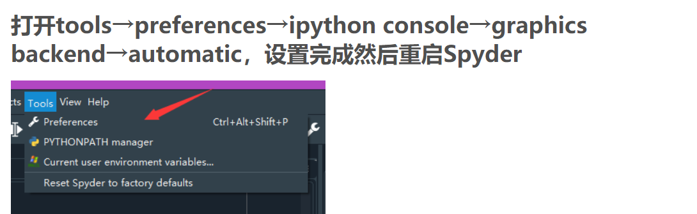
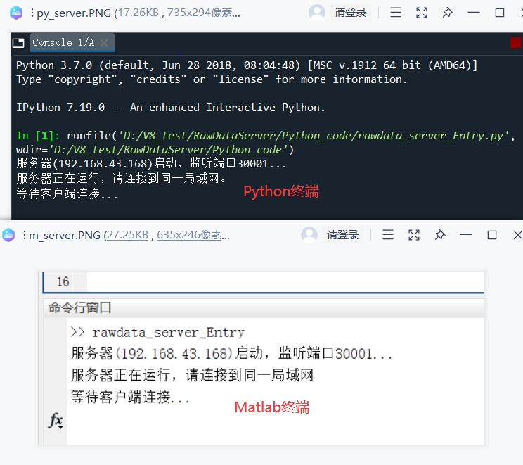
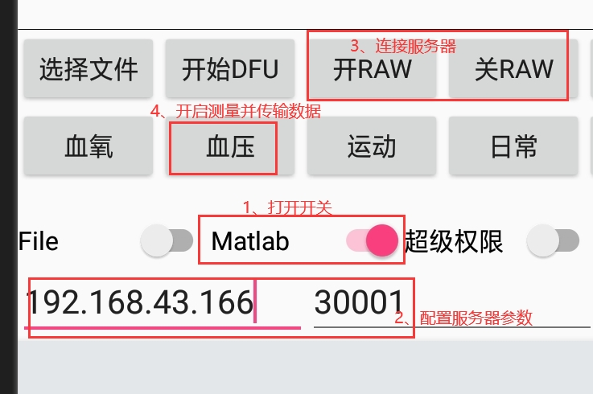

# 1、RawData格式
## a,PTT的模式
> 包含基本字段：
> (1)RawData类型（RawData Type）：占一字节，取值为0x60
> (2)协议号（Protocol）： 占一字节，取值为0x01
> (3)包序号（Sequence Number）： 占四字节，网路字节序
> (4)包内PTT帧的个数（Frame count）： 占一字节，当前版本AFE4900配置，一次FIFO_RDY中断获取10帧
> (5)包内PTT帧（Frame<y> Elemt，y=0,1,2...）： 占六字节，由以下结构体定义：
|Field|green_msb|green_midb|green_lsb|ecg_msb|ecg_midb|ecg_lsb|
|:---:|:---:|:---:|:---:|:---:|:---:|:---:|:---:|
| Offset| 0x00| 0x01 | 0x02  | 0x03 | 0x04 |0x05|0x05|

+ 固定长度析包函数（当前版本采纳的）：get_ptt_frames_v1(old_tcp_stream, new_tcp_stream)
> 功能说明：解析固定长度的Notify包，此版本的包长度为MTU，即244字节，空闲字段（Pack）补0。字段说明如下：
|RawData Type|Protocol|Sequence Number|Frame count|Frame<0> Elemt|...|Frame<y> Elemt| Pack |
|:---:|:---:|:---:|:---:|:---:|:---:|:---:|:---:|
|Byte0|Byte1|Byte2-Byte5|Byte6|Byte7-Byte12|...|Byte<5y+7>-Byte<5y+12>|Byte<5y+13>-Byte243|
| 0x60| 0x01|  {X,X,X,X} | y+1  | {X,X,X,X,X,X}|...|  {X,X,X,X,X,X} |default:{0,0,...,0}|

+ 变长的析包函数：get_ptt_frames_v2(old_tcp_stream, new_tcp_stream)
> 功能说明：解析变长的Notify包，包的最小长度为7，最大长度为最大MTU（244字节）。字段说明如下：
|RawData Type|Protocol|Sequence Number|Frame count|Frame<0> Elemt|...|Frame<y> Elemt|
|:---:|:---:|:---:|:---:|:---:|:---:|:---:|:---:|
|Byte0|Byte1|Byte2-Byte5|Byte6|Byte7-Byte12|...|Byte<5y+7>-Byte<5y+12>|
| 0x60| 0x01|  {X,X,X,X} | y+1  | {X,X,X,X,X,X}|...| {X,X,X,X,X,X} |

## b,SPO2的模式(此版本暂不支持)

## c,EHR的模式(此版本暂不支持)

# 2、安装准备环境
> Rawdata的Server端，提供Matlab和Python实现的脚本。能够实现PTT、SPO2(此版本暂不支持)和EHR(此版本暂不支持)的实时绘图功能。
> 由于不提供二进制执行文件，需要在相应的IDE运行。

## a,Matlab脚本
>开发环境：MATLAB R2017a

## b,Python脚本
>开发环境：Python 3.7;  Anaconda3-5.3.1; PyCharm 2020.2.1 (Community Edition);

### 附：
+ Anaconda3
> (1)下载地址：清华镜像（https://mirrors.tuna.tsinghua.edu.cn/anaconda/archive/Anaconda3-5.3.1-Windows-x86_64.exe）
> (2)依赖包安装： Anaconda3->Environments,使用图形界面勾选并安装缺失的包
> (3)画图还另外对Spyder设置：

> (4)Spyder中"Reloaded modules"错误的解决方法:点击菜单栏Tools->Preferences->Python interpreter->User Module Reloader (UMR)，将Enable UMR的选项取消，重新启动spyder
+ PyCharm 
> (1)下载地址：腾讯软件钟心（https://dl.softmgr.qq.com/original/System/pycharm-community-2020.2.1.exe）
> (2)添加清华镜像源： 
> (2)依赖包安装：终端执行命令： <pip install matplotlib>

## 3、RawData服务器地址\端口查看
### a,Matlab脚本
>	Matlab2017打开并运行脚本：”.\RawDataServer\Matlab_code\rawdata_server_Entry.m“
### b,Python脚本
>	Anaconda3->Home->Spyder打开并运行脚本: ”.\RawDataServer\Python_code\rawdata_server_Entry.py“

###### 脚本运行结果如下：
> 脚本自动输出本机IP和端口

## 4、SDK配置服务器参数与开启RawData传输
>	手机端根据控制台输出的信息，配置相关参数：IP和端口
>	配置好参数以后，按照以下步骤开启Rawdata.

# 功能介绍
> 提供实时显示和离线显示功能，默认情况下作为服务器，但通过配置，也可以解析SDK保存的dat文件。
## 脚本运行模式running_type
### 1、实时模式：RUNNING_MODE_SERVER;
### 2、解析dat文件模式：RUNNING_MODE_FILE;

## 注意，目前只实现Matlab解析SDK保存的dat文件，但是MegaTools2.0,4少保存5个字节，可对以下进行适配：
### 1、 设置脚本运行模式running_type = RUNNING_MODE_FILE；
### 2、 设置get_ptt_frames_v1()中的 PROTOCOL_V1_LENGTH = 239

## 1、实时显示功能（功能已经实现，文档待完善）

## 2、离线显示功能（功能已经实现，文档待完善）
