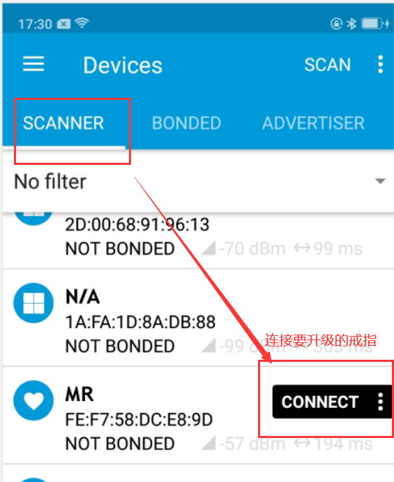
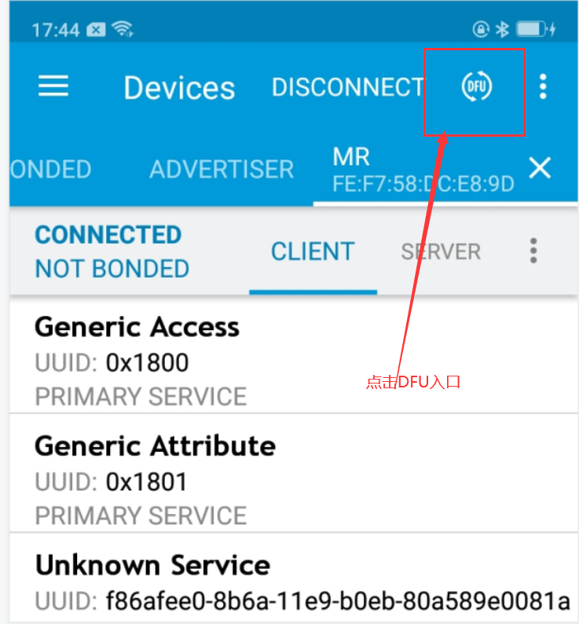
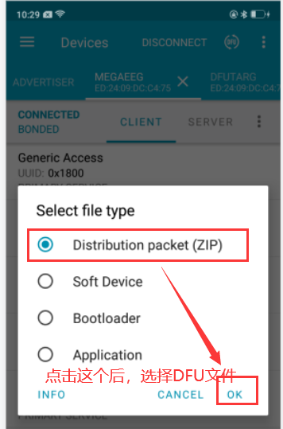
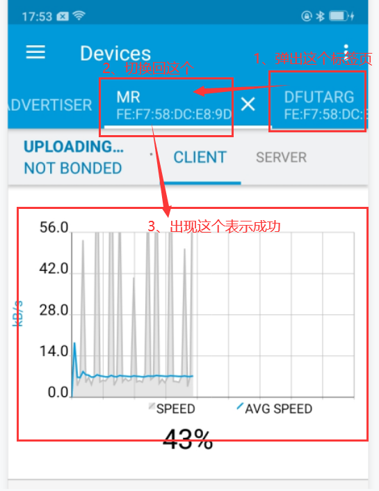

# 一、四合一固件（app-sd-bl-bs）的制作

## 1、编译SecBootloader
> 打开目录下的“ .\BootLoader\secure_bootloader\pca10056_ble_debug\arm5_no_packs”下的工程，编译得到“SecBootloader_debug.hex”。

## 2、编译出厂固件
> 打开目录“.\Firmware\project\MDK”下的工程，根据当前最新的SVN版本号（右键->TortoiseSVN->Show log）,修改“svn_rev.c”文件,再编译得到“Ring8.hex”。

## 3、生成bootloader_settings
> 打开目录“.\scripts\scripts”，运行脚本“bootsettings-make.bat”，生成“bootloader_settings_release.hex”。

## 4、生成
> 打开目录“.\scripts\scripts”，运行脚本“debug_app-sd-bl-bs-full.bat”，生成“Bootloader_XXXX_full_release.hex”。

# 二、四合一固件（app-sd-bl-bs）的烧写
## 1、方法一：使用“nRF Connect for Desktop”烧写
+ a,安装“nRF Connect for Desktop”

+ b、替换主机hosts文件
 > 替换hosts文件后，可以不用翻墙更新工具，hosts文件位于“.\scripts\\.Src”下

+ c、下载并打开“Programmer”
> 添加四合一固件，并烧写

# 三、出厂固件（RingXXXXX.zip）的DFU方法

## 1、方法一：使用“nRF Connect for Mobile”升级
+ a, 选择需要连接的设备

+ b, 点击DFU入口准备升级

+ c, 选择“*.zip”固件，编译以后，固件放在“.\scripts”下

+ d, DFU成功后弹出这个页面

